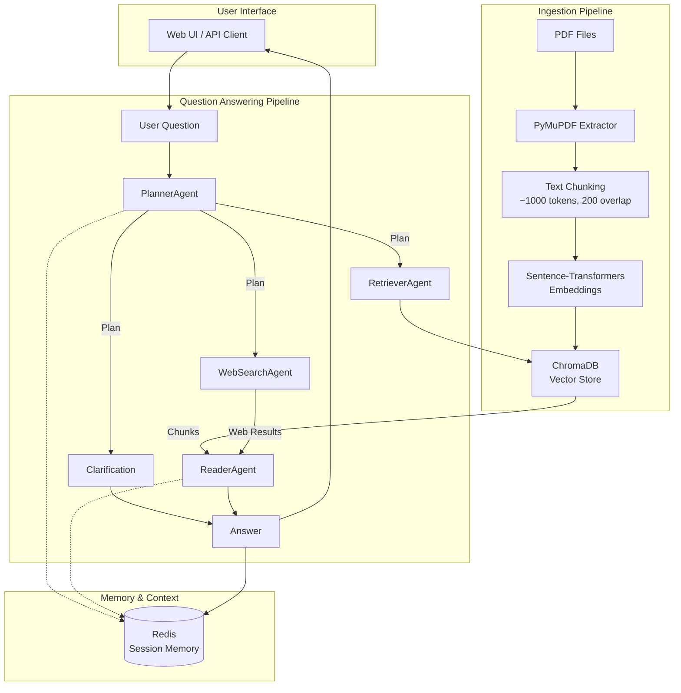

# ChatPDF

A Retrieval-Augmented Generation (RAG) system for querying PDF documents using multi-agent architecture. The system intelligently decides when to search locally stored PDFs or fetch information from the web, providing contextually aware answers with session-based memory.

## How It Works

### Architecture Overview



### Agent Descriptions

The system uses a multi-agent architecture where each agent has a specific responsibility:

#### 1. **PlannerAgent**
- **Role**: Orchestrates the Q&A workflow by deciding the optimal action sequence
- **Capabilities**: 
  - Analyzes user questions and conversation history
  - Determines whether to retrieve from PDFs, search the web, or ask for clarification
  - Generates a JSON plan of actions (no hardcoded rules)
- **Output**: Action plan (e.g., `[{"action": "RETRIEVE", "args": {"k": 5}}, {"action": "ANSWER"}]`)

#### 2. **RetrieverAgent**
- **Role**: Performs semantic search over ingested PDF chunks
- **Capabilities**:
  - Uses sentence-transformers for query embedding
  - Searches ChromaDB vector store for relevant chunks
  - Augments queries with conversation history for follow-up questions (e.g., "tell me more about it")
- **Output**: List of relevant document chunks with metadata

#### 3. **ReaderAgent**
- **Role**: Synthesizes answers from retrieved context
- **Capabilities**:
  - Combines PDF chunks and/or web search results
  - Uses LLM (via OpenRouter) to generate coherent answers
  - Incorporates session history for context-aware responses
- **Output**: Natural language answer grounded in provided context

#### 4. **WebSearchAgent**
- **Role**: Fetches up-to-date information from the web
- **Capabilities**:
  - Uses SearchAPI.io (Google engine) for real-time search
  - Prioritizes recent news and articles
  - Returns structured results with titles, URLs, dates, and snippets
- **Output**: Web search results formatted for context

#### 5. **SessionMemory** (Redis-based)
- **Role**: Maintains conversation history per session
- **Capabilities**:
  - Stores question-answer pairs with sources
  - Enables follow-up questions and context continuity
  - Supports clearing memory per session

### Key Features

- **Intelligent Routing**: LLM-based planner autonomously decides between PDF retrieval and web search
- **Session Memory**: Maintains conversation context using Redis
- **Hybrid Search**: Seamlessly combines local PDF knowledge with real-time web information
- **Automatic Web Fallback**: If PDF retrieval fails or lacks information, automatically searches the web
- **Web UI**: ChatGPT-like interface with chat history sidebar and PDF upload
- **Multi-PDF Upload**: Upload and ingest multiple PDFs simultaneously via web interface
- **Conversation Management**: Create new chats, switch between conversations, and clear session memory
- **RESTful API**: Full API access for integration

## How to Run Locally Using Docker Compose

### Prerequisites

- Docker and Docker Compose installed
- API keys for:
  - OpenRouter (for LLM access)
  - SearchAPI.io (for web search)

### Setup

1. **Clone the repository**
   ```bash
   git clone <repository-url>
   cd ChatPDF
   ```

2. **Configure environment variables**
   
   Create a `.env` file in the project root with:
   ```env
   OPENROUTER_API_KEY=your_openrouter_api_key
   OPENROUTER_MODEL=google/gemini-2.5-flash-lite
   REDIS_URL=redis://redis:6379/0
   SEARCHAPI_API_KEY=your_searchapi_key
   ```

3. **Build and start services**
   ```bash
   docker-compose up --build
   ```

   This will:
   - Build the FastAPI application container
   - Start Redis for session memory
   - Mount volumes for PDFs, data persistence, and live code reload

4. **Access the application**
   - Web UI: http://localhost:8000/
   - API Docs: http://localhost:8000/docs
   - Health Check: http://localhost:8000/health

### Ingest PDFs

There are two ways to ingest PDFs:

#### 1. **Via Web UI (Recommended)**
Once the containers are running:
1. Open http://localhost:8000/ in your browser
2. Click "Upload PDFs" in the sidebar
3. Select one or more PDF files
4. Files are automatically uploaded, ingested, and ready for querying

#### 2. **Via Command Line**
```bash
# Ingest a single PDF
docker-compose exec app python -m app.ingest.ingest_pdfs /app/pdfs/your-file.pdf --doc-id my_document

# Ingest all PDFs in the pdfs/ directory
docker-compose exec app python -m app.ingest.ingest_pdfs /app/pdfs
```

The ingestion process:
- Extracts text from PDFs using PyMuPDF
- Chunks text into ~1000 token segments with 200 token overlap
- Generates embeddings using sentence-transformers
- Stores vectors and metadata in ChromaDB

### Docker and Docker Compose Files

#### `docker-compose.yml`
Defines two services:
- **app**: FastAPI backend with mounted code for live reload
- **redis**: Session memory storage

Key configurations:
- Volume mounts for `./app`, `./data/chroma_db`, and `./pdfs`
- Environment variables for API keys and configuration
- Port mappings (8000 for app, 6379 for Redis)

#### `app/Dockerfile`
- Base: Python 3.11-slim
- Installs dependencies from `requirements.txt`
- Uses asyncio event loop (compatible with duckduckgo-search)
- Runs Uvicorn on port 8000

### Directory Structure

```
ChatPDF/
├── app/
│   ├── agents/          # Multi-agent system (Planner, Retriever, Reader, WebSearch)
│   ├── api/             # FastAPI routes (qa, memory, upload)
│   ├── core/            # Core components (vectorstore, embeddings, web_search, etc.)
│   ├── ingest/          # PDF ingestion scripts
│   ├── ui/              # Web UI (HTML/CSS/JS)
│   ├── Dockerfile       # Container definition
│   └── main.py          # FastAPI app entry point
├── data/                # Persistent data (ChromaDB, Redis)
│   ├── chroma_db/       # Vector store database
│   └── redis/           # Session memory database
├── pdfs/                # PDF files to ingest
├── docker-compose.yml   # Orchestration
├── requirements.txt     # Python dependencies
└── .env                 # Environment variables (not in git)
```

## API Usage

### Ask a Question

```bash
curl -X POST http://localhost:8000/v1/ask \
  -H "Content-Type: application/json" \
  -d '{
    "question": "What is the main contribution of this paper?",
    "session_id": "my-session-123"
  }'
```

Response:
```json
{
  "answer": "...",
  "sources": ["doc1", "doc2"],
  "plan": [
    {"action": "RETRIEVE", "args": {"k": 5}},
    {"action": "ANSWER"}
  ]
}
```

### Upload PDF Files

```bash
curl -X POST http://localhost:8000/v1/upload \
  -F "files=@document1.pdf" \
  -F "files=@document2.pdf"
```

Response:
```json
{
  "status": "completed",
  "results": [
    {"filename": "document1.pdf", "status": "success", "chunks_ingested": 42},
    {"filename": "document2.pdf", "status": "success", "chunks_ingested": 28}
  ],
  "summary": {
    "total_files": 2,
    "successful": 2,
    "failed": 0,
    "total_chunks_ingested": 70
  }
}
```

### Clear Vector Store

```bash
curl -X POST http://localhost:8000/v1/clear_vectorstore
```

Removes all ingested documents from ChromaDB.

### Clear Session Memory

```bash
curl -X POST http://localhost:8000/v1/clear_memory \
  -H "Content-Type: application/json" \
  -d '{"session_id": "my-session-123"}'
```

### Get Session History

```bash
curl "http://localhost:8000/v1/history?session_id=my-session-123"
```

Returns all conversation turns for the specified session.

## Future Improvements

- Authentication
- Advanced memory management (summarize long conversation histories, support cross-session knowledge transfer)
- Multi-language support
- Source citation with page numbers
- Search within conversations
- Rate limiting and request queuing
- Error handling and retry mechanisms
- Track API usage and performance
- Optimized for production scale
- Better Web Search Integration
- Real-time UI updates as the LLM generates responses
- Enable more complex agent workflows and loops

## Technology Stack

- **Backend**: FastAPI (Python 3.11)
- **LLM**: OpenRouter API (Google Gemini 2.5 Flash Lite)
- **Vector Store**: ChromaDB
- **Embeddings**: Sentence-Transformers (all-MiniLM-L6-v2)
- **Web Search**: SearchAPI.io (Google engine)
- **Session Memory**: Redis
- **PDF Processing**: PyMuPDF (fitz)
- **Containerization**: Docker & Docker Compose
